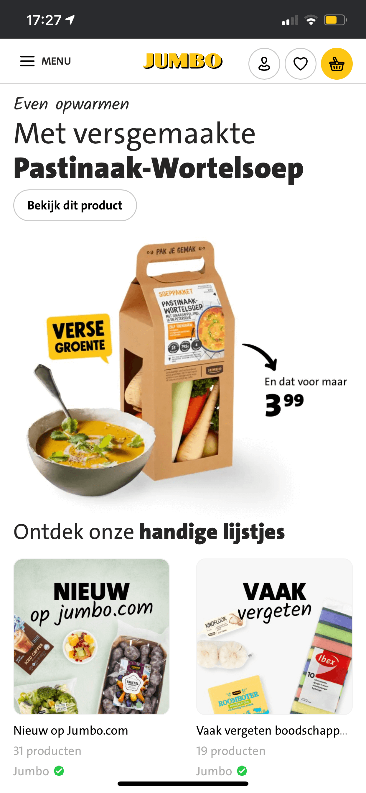

# Procesverslag
**Auteur:** Robin van Houten

## Bronnenlijst
1. -bron 1-
2. -bron 2-
3. -...-

## Herkansing

## Eindgesprek (week 7/8)

Tijdens het gesprek gaf ik gelijk al aan dat ik voor de herkansing ging. Heb na voortgang 2 er geen tijd meer in gestoken en is er dus niks veranderd ten opzichte van toen. De feedback was dan ook niet heel veel anders dan voortgang 2 en 3. Eind cijfer is een 4,5

**Screenshot(s):**

## Voortgang 3 (week 6)

Geen progressie gemaakt sinds vorige voortgang op wat foto's inzetten na dus feedback bleef bij het zelfde.

## Voortgang 2 (week 5)

-Goed-
Robert had snel door dat ik al eens eerder websites gemaakt had en vond de structuur er al aardig uit zien.

-verbetering-
het viel op dat ik via een bootstrap manier programmeerde dit was niet perse slecht.
De volgorde van h1 naar h6 kan beter. Nu staat er wat door elkaar. Gebruik maken van nav ipv section voor de navigatie.
pixels omzetten in em.

## Voortgang 1 (week 3)

-Goed-
Zag er goed uit en was al lekker op weg.

-verbetering-
Button aanpassen naar een A element
span mag gebruikt worden (naar aanleiding van mijn vraag)

## Breakdownschets (week 1)

## Intake (week 1)

**Je startniveau:** rood

**Je focus:** Surface plane (denk ik)

**Je opdracht:** https://www.jumbo.com/

**Screenshot(s) van de eerste pagina (small screen):**

**Screenshot(s) van de tweede pagina (small screen):**

